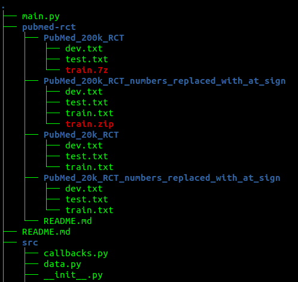
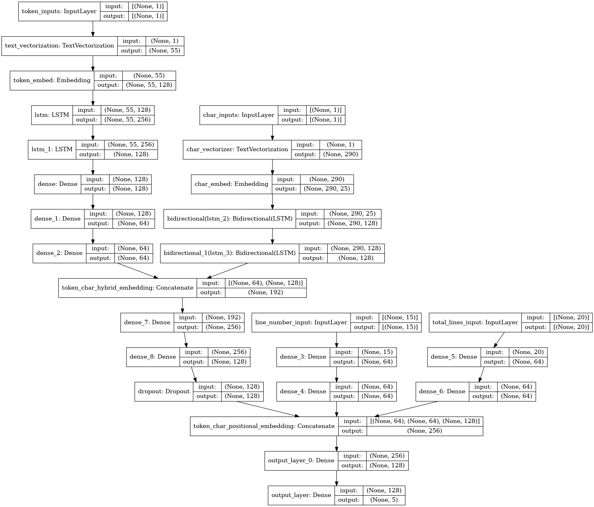

# Sequential-sentence-classification-on-PubMed-RCT

In this repo, we'll be doing sequential sentence classification using token, character and positional embeddings based on this [paper](https://arxiv.org/abs/1710.06071)

To use this repo, please clone this [repo](https://github.com/Franck-Dernoncourt/pubmed-rct)

Place it in the same repo as this repo as shown in the figure below. 

The structure of the project is as follows. 

 - src/models.py
    - contains all the different network architectures to run experiments on.
 - src/data.py
   - contains all the necessary pre-processing actions that need to be carried out to convert 
     it into a tf.data.Dataset pipeline for the model. 
 - src/callbacks.py
   - all the callbacks for model training and monitoring is located here. 
 - train.py
   - uses all the above mentioned files to start training the model. 
 
 usage: 
`python3 train.py --epochs 25 --train True`

The model architecture which uses token, chars and positional embeddings is as follows:

Everything else is pretty much self-explanatory. 

If you have any questions, please feel free to contact me at shreyas0906@gmail.com or raise an issue and i will have a
look into it. 

